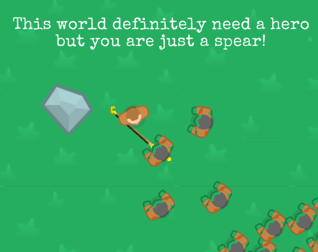
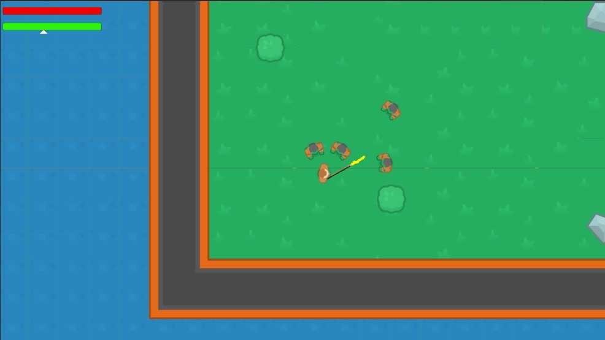
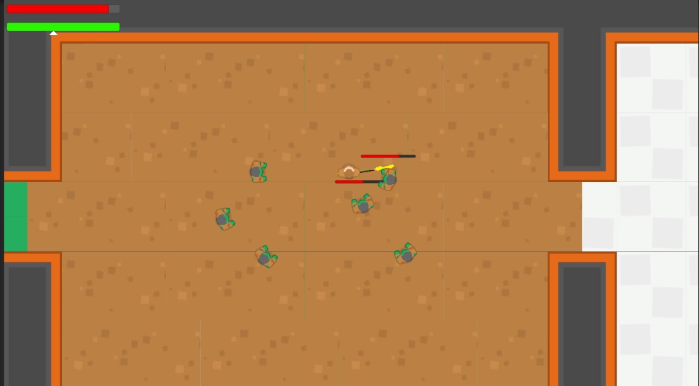

# [This world definitely need a hero but you are just a spear!](https://teamon.itch.io/this-world-definitely-need-a-hero-but-you-are-just-a-spear)
[TriJam #63: The 3 hour game jam](https://itch.io/jam/trijam-63)  
Theme: Weather The Storm  

Well, you are a ancient artifact that used to save world from waves. Every 100 years a hero summoned to use spear and slay all monsters. But now they summon teenager and he even don't know how to fight! Help him to survive and save the world.  
Made in 3 hours for TriJam-63. Completely underestimate my tasks, so quite unfinished game. Wanna to make it roguelike, but for now just first room & basic mechanics.

# Downloads and Links
Available in [Windows, OSX, Linux and Web](https://teamon.itch.io/this-world-definitely-need-a-hero-but-you-are-just-a-spear). If you encounter any problem, please leave a issue! 

#  How to play
 * **Mouse** - aim
 * **LMB** - attack (lunge​)
 * **Space** - dash in boi moving direction
 * And ye, boi going to move in random directions, usually right under attack

# What is TriJam?
TriJam is a jam where your goal is to try and make something playable (and fun) in only 3 hours! How is that even possible, you ask? Well, just look at the history of previous TriJams and we're sure you'll be convinced that it is not only possible, but very manageable!

# Used assets:
 * [Main theme](https://selene-rocknight.itch.io/posse) - Possessed
 * [Die theme](https://digidragon.itch.io/snow) - A Village Sunken in Snow
 * [Win theme](https://kmacleod.itch.io/song-of-the-ice-queen) - Song of the Ice Queen
 * [Main menu music](https://kindaw.itch.io/kindaws-music-dump) - Waiting for the Prof
 * [Special Elite font](https://www.fontsquirrel.com/fonts/special-elite)
 * [Spear](https://www.vippng.com/preview/hwiomRx_lightning-spear-pixel-spear/)
 * [Chains](https://twitter.com/neobrsk/status/599750416755101696)
 * [Rock](https://twitter.com/neobrsk/status/599750416755101696)
 * [All other art](https://www.kenney.nl/assets/topdown-shooter)

# Screenshots
  
  
  
